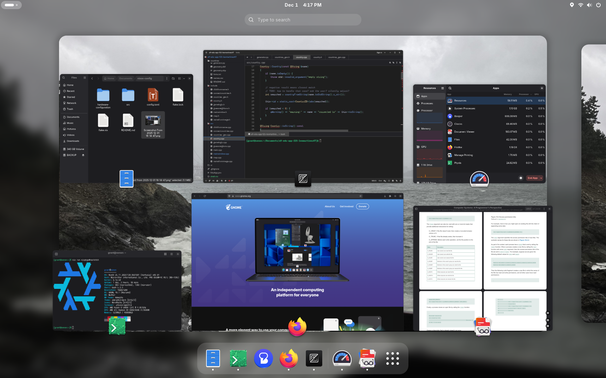

# a humble nixos config

This is my [NixOS](https://nixos.org) configuration. It includes a near-stock [GNOME](https://gnome.org) desktop environment with a few tweaks to make it a bit more cohesive.

Features:
 - Personal info config file
 - Adwaita GTK3/QT theme, blurred GNOME Shell
 - Minimal Firefox w/GNOME theme & select extensions
 - VSCode w/Adwaita Theme and Nix/Rust/JS extensions
 - English/Korean IME input
