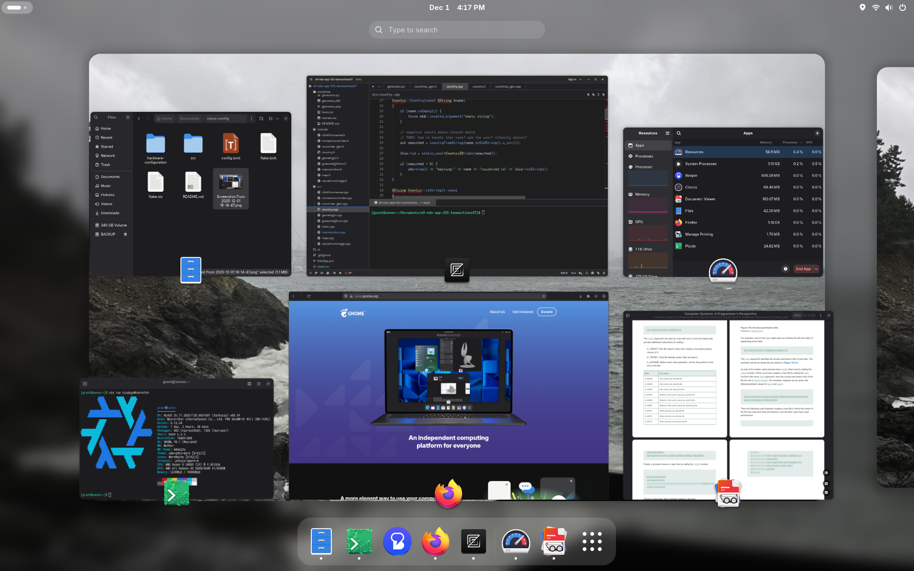

# a humble nixos config

This is my [NixOS](https://nixos.org) 26.05 configuration for my laptop, desktop, and homelab.

It includes a near-stock [GNOME](https://gnome.org) desktop environment with a few tweaks to make it a bit more cohesive.

Features:

 - Personal info config file for user-specific items
 - Adwaita GTK3/QT theme, blurred GNOME Shell
 - Minimal & secure Firefox w/GNOME theme & select extensions
 - Zed w/Adwaita Theme
 - Tailscale w/automatic SSH aliases & file manager bookmarks
 - University of Utah VPN helper
 - Headscale & Headplane on Radon, w/Caddy HTTPS & DuckDNS
 - Encrypted secrets w/agenix
 - Optional Navidrome/Beets music & Immich photo modules
