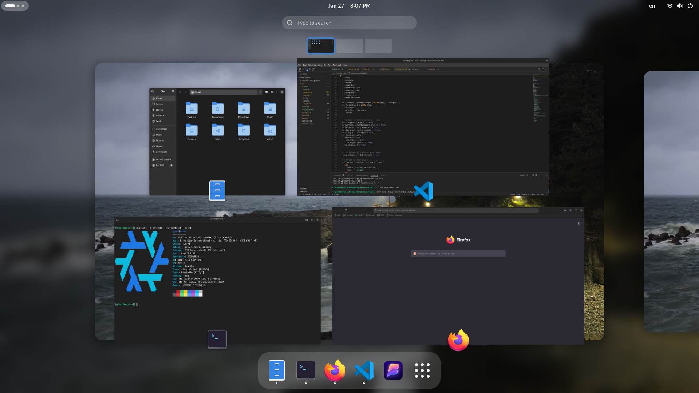

# a humble nixos config

This is my [NixOS](https://nixos.org) configuration. It includes a near-stock [GNOME](https://gnome.org) desktop environment with a [few tweaks](./gnome.nix) to make it a bit more cohesive. I recommend writing your own as an exercise but if you want to use mine you can enter your info in [`config.toml`](./config.toml).